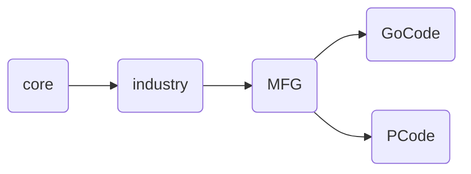

### Git Store password
git config --global credential.helper store
git config --global user.email "jingxi@me.com"
git config --global user.name "jingxi"


### Mindmap Note



### CI/CD
```

stages:          # List of stages for jobs, and their order of execution
  - build
  - test
  - deploy
# image: mcr.microsoft.com/dotnet/sdk:6.0.406-jammy-amd64
build-job:       # This job runs in the build stage, which runs first.
  stage: build
  script:
    - echo "Compiling the code..."
    - ls
    - dotnet restore
    - echo "Compile complete."
unit-test-job:   # This job runs in the test stage.
  stage: test    # It only starts when the job in the build stage completes successfully.
  script:
    - echo "Running unit tests... This will take about 60 seconds."
    - echo "sleep 60"
    #- dotnet test --no-build -c Release   -l  "trx;LogFileName=../../testRes.trx"
    - dotnet test   -l  "trx;LogFileName=../../testRes.trx"
  
    #- echo "Code coverage is 90%"
  after_script:
     - /root/.dotnet/tools/trx2junit testRes.trx
  artifacts:
    when: always
    paths: ['testRes.xml']
    expose_as: 'testing report'
    reports:
      junit: testRes.xml

 
deploy-job:      # This job runs in the deploy stage.
  stage: deploy  # It only runs when *both* jobs in the test stage complete successfully.
  script:
    - echo "Deploying application..."
    - echo "Application successfully deployed."

```
